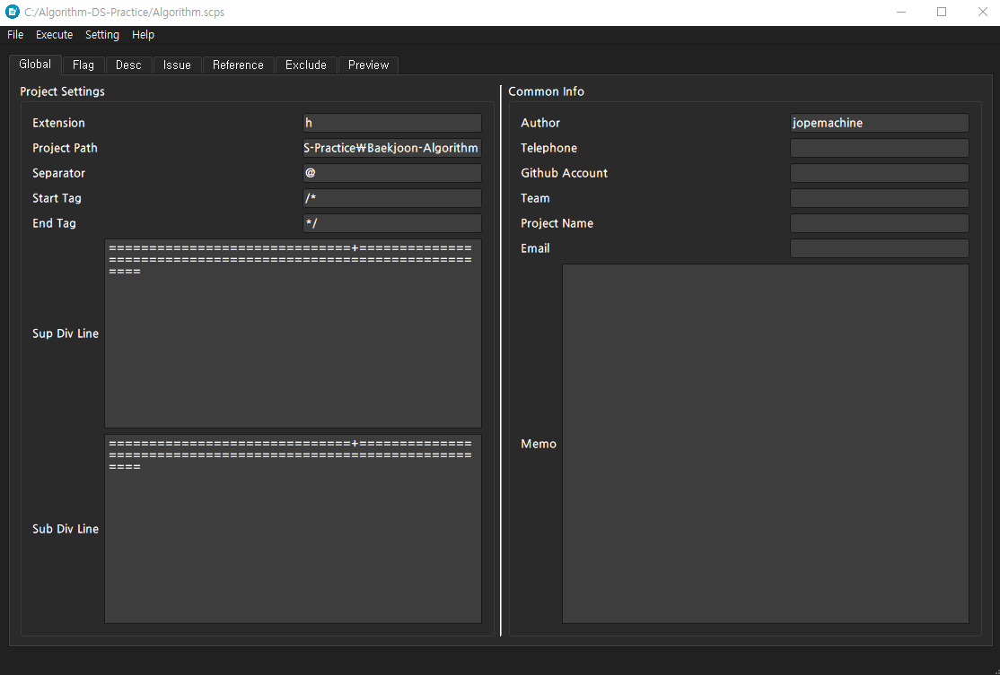
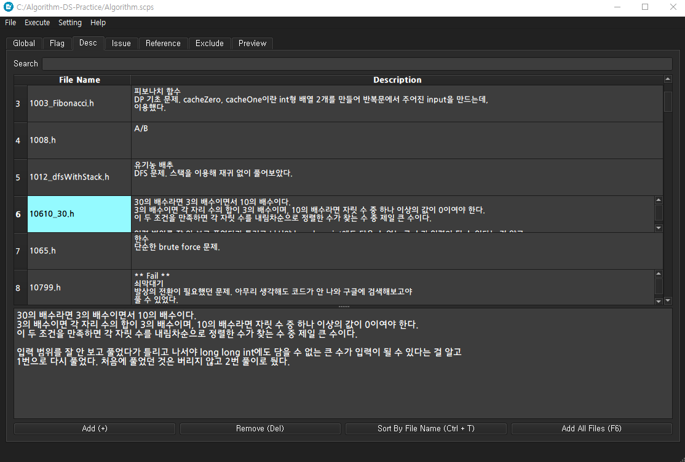
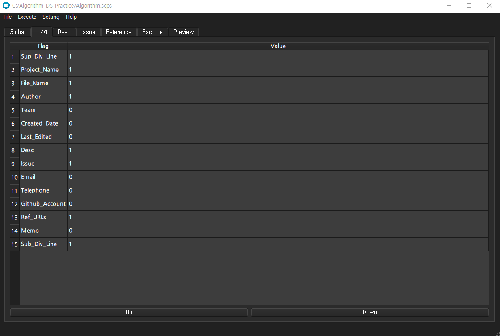

<h2>Outline</h2>

[](https://www.codacy.com?utm_source=github.com&amp;utm_medium=referral&amp;utm_content=jopemachine/Summary-Commenter&amp;utm_campaign=Badge_Grade)

2019 Personal Project


## Summary Commenter

지정한 프로젝트 내 타겟 확장자 파일들에 지정한 주석을 추가하는 프로그램.


## Development Environment

> Windows 10,  64 bit
>
> Desktop Qt 5.13.0, MinGW 64-bit
>
> Qt Creator 4.9.2


## How to use

주석을 달기 위한 프로젝트 path를 Global 탭의 Project Path에 입력하고, 주석이 달릴 파일의 확장자를 Extension에 입력한다.

프로그램이 주석을 인지하는 방식은 Divide by seperator와 Divide by Start End Tag로 나뉜다.

해당 옵션은 Setting > Comment Style에서 변경한다.

언어마다 주석의 구분자가 다르므로, Global 탭에서 Separator로 원하는 문자로 변경할 수 있다.

Sup Div Line엔 주석의 위쪽 라인에 출력할 문장을, Sub Div Line엔 주석의 아래 쪽에 출력할 문장을 입력한다.

파일들에 모두 공통적으로 달릴 정보는 Global 탭의 Common Info에 입력해 변경한다.

Flag 탭에서 Common Info와 파일 이름, 파일의 만들어진 날짜 등을 출력할지를 변경할 수 있다.

Flag 탭에서 Value이 1로 표기된 항목은 주석에 추가될 정보가 되고 0으로 표기된 정보는 주석에 추가하지 않는다. 

Desc, Issue, Reference 탭에선 원하는 파일들의 정보를 편집할 수 있다.

이 세 탭에서 파일을 추가하는 방식은 아래 세 가지이다.

```
1 - 직접 Add 버튼을 눌러 파일을 추가
2 - 파일을 테이블에 드래그 앤 드롭으로 추가
3 - Add All Files 버튼을 눌러 해당 프로젝트 디렉토리의 타겟 확장자에 해당하는 모든 파일을 추가
```

Desc, Issue 탭에선 Search Edit을 활용해 해당 내용을 검색할 수 있다.

Exclude 탭에선 해당 디렉토리에 있는 타겟 확장자 파일이지만, 추가되길 원하지 않는 파일을 등록해 사용할 수 있다.

Preview 탭에선 확장자 파일들에 어떻게 주석이 추가될 지 미리 볼 수 있다

(Desc, Issue, Ref URL 등의 파일마다 다른 정보는 빈 줄로 표시됨)

프로그램에서 수정하거나 추가한 정보들은 scps란 자체 확장자를 가진 파일로 저장할 수 있고, scps 파일로 프로그램을 열 수 있다.


## How to work

**scps 파일** : SummaryCommenter가 사용하는 설정 파일. 정규식을 이용해 읽어들임. 기본적으로 아래 값 들을 갖고 있고,  
`{ fileName }::[ desc | issue | urls ] += { content }` 형식으로 값을 작성해,  해당 파일 주석에 값을 추가할 수 있음.

```
# Setting
setting.descNumbering        =   0
setting.issueNumbering       =   0
setting.refURLNumbering      =   0
setting.recursiveTraversal   =   1
setting.divBySeparator       =   0
setting.divByStartEndTag     =   1

# Flags
flag.Sup_Div_Line   =   1
flag.Project_Name   =   1
flag.File_Name   =   1
flag.Author   =   1
flag.Team   =   1
flag.Created_Date   =   1
flag.Last_Edited   =   1
flag.Desc   =   1
flag.Issue   =   1
flag.Email   =   1
flag.Telephone   =   1
flag.Github_Account   =   1
flag.Ref_URLs   =   1
flag.Memo   =   1
flag.Sub_Div_Line   =   1

# Globals
global.Extension        =  ""
global.Project_Name     =  ""
global.Project_Path     =  ""
global.Author           =  ""
global.Separator        =  " * "
global.StartTag         =  "/*"
global.EndTag           =  "*/"
global.Sub_Div_Line     =  "==============================+==============================================================="
global.Sup_Div_Line     =  "==============================+==============================================================="
global.Email            =  ""
global.Telephone        =  ""
global.Github_Account   =  ""
global.Team             =  ""
global.Memo             =  ""
```


아래처럼 desc, issue, urls 값만 명시한 scps 파일의 경우 Open하면 flag, global 값은 변하지 않고 import한 파일의 설정만 추가하는 식으로 이용할 수도 있음.


```
# [*.scps]
constant.h::desc       	+=              상수 값들을 모아놓은 헤더 파일
mainwindow.cpp::desc	+=		이벤트 처리 메인 윈도우 구현 파일
gamemanager.cpp::issue	+=		버그 있음
gamemanager.cpp::urls	+=		https://urlexample.com
constant.h::urls        +=		https://urlexample2.com
```


**scproj 파일** : Run 후 지정된 경로에 생성됨.  작업했던 파일들의 이름들을 갖고 있는 파일. scproj 파일을 통해 Remove Comments 버튼을 눌러 SummaryCommenter가 추가했던 주석을 제거할 수 있다.


```
# Worked_Method
DivByStartEndTag_t: "-->"

# Worked_Files
: "Jekyll-Script.html,Comment.php,CommentExample.html..."

```


**sclately 파일** : 최근 열었던 scps 파일들의 경로를 5개 까지 기억하고 있음. SummaryCommenter 실행 시 가장 최근에 열렸던 scps 파일을 자동으로 셋팅하며, Open Recents 버튼으로 이 경로의 scps 파일들에 접근할 수 있음.


## Caution

프로그램 작동 상 주의할 점은 아래와 같다.

* 지정한 디렉토리 내에 중복되는 이름을 가진 파일이 없다고 가정하고 작동한다. 중복되는 이름이 있는 파일이 있는 경우, Desc, Issue 등이 파일에 제대로 추가되지 않을 수 있음.
* SummaryCommenter가 추가한 주석을 변경하거나, 그 위에 다른 주석, 코드를 추가하면 문제가 발생할 수 있음.
* scproj 파일을 임의로 삭제하거나 변경하면, 주석 업데이트 시 중복 주석이 추가되는 등 문제 발생의 원인이 됨


<h2>Screen shots</h2>
<p align="center">

</p>


* 위 설정으로 만들 수 있는 주석의 예.

```
// ==============================+=====================================...
// @ Author : jopemachine
// @ Last Edited : 2019-08-13, 18:35:15
// @ Desc : 
// @     1. 메인 윈도우의 구현 파일이다.
// @ Issue : 
// @ Email : jopemachine@naver.com
// @ Contact : 012-345-6789
// @ Github Account : gravityc95@gmail.com
// @ Ref URLs : 
// @     1. https://github.com/jopemachine/CommentHelper
// @     2. https://github.com/jopemachine/Gomoku-Qt
// @ Memo : 
//  1. 메모 1
//  2. 메모 2
//  3. 메모 3
// ==============================+=====================================...
```


<br>

* Desc 탭

<p align="center">

</p>

<br>

* Flag 탭

<p align="center">

</p>